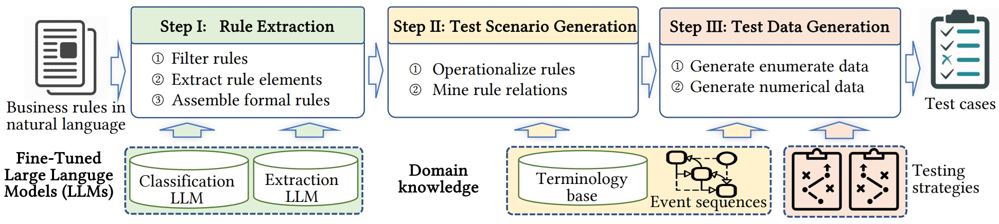
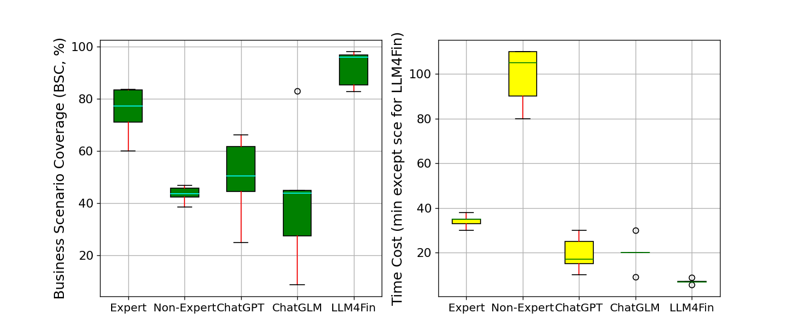
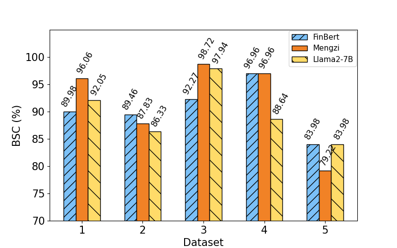

# LLM4Fin

LLM4Fin is a prototype tool for automatically generating test cases from natural language business rules. It is the official implementation for paper "[LLM4Fin: Fully Automating LLM-Powered Test Case Generation for FinTech Software Acceptance Testing](https://doi.org/10.1145/3650212.3680388)" accepted by **ISSTA 2024**. The process of LLM4Fin can be divided into three steps: **I**. Rule Extraction, **II**. Test Scenario Generation, **III**. Test Data Generation. The workflow is shown as below. Step I.1 and Step I.2 are performed by fine-tuned LLMs, and the other steps are implemented by well-designed algorithms. We evaluate it on real-world stock-trading software. Experimental results shows that LLM4Fin outperforms both general LLMs like ChatGPT and skilled testing engineers, on the business scenario coverage, code coverage, and time consumption. 




## Installation
Install step-by-step:

1. Install dependencies.

    ```bash
    sudo apt update
    sudo apt upgrade -y
    sudo apt install build-essential zlib1g-dev libbz2-dev libncurses5-dev libgdbm-dev libnss3-dev libssl-dev libreadline-dev libffi-dev
    sudo apt-get install -y libgl1-mesa-dev
    sudo apt-get install libglib2.0-dev
    sudo apt install wget
    sudo apt install git
    ```

2. Install miniconda.

    ```bash
    cd ~
    wget https://repo.anaconda.com/miniconda/Miniconda3-latest-Linux-x86_64.sh
    bash Miniconda3-latest-Linux-x86_64.sh
    source ~/.bashrc
    ```

3. Create a virtual python environment and install all the required dependencies.
```bash
    git clone https://github.com/13luoyu/intelligent-test
    cd intelligent-test
    conda create -n intelligent-test python=3.9
    conda activate intelligent-test
    pip install -r requirements.txt

    # Install flash-attention based on your CUDA version. For example:
    wget https://github.com/Dao-AILab/flash-attention/releases/download/v2.5.6/flash_attn-2.5.6+cu118torch2.0cxx11abiFALSE-cp39-cp39-linux_x86_64.whl
    pip install flash_attn-2.5.6+cu118torch2.0cxx11abiFALSE-cp39-cp39-linux_x86_64.whl
    
    pip install -e .
```

4. Download the trained LLMs.
```bash
    git lfs install
    git clone https://huggingface.co/13luoyu/LLM4Fin
    cp -r LLM4Fin/* model/trained/
    rm -rf LLM4Fin

    cd model/pretrained
    git clone https://huggingface.co/Langboat/mengzi-bert-base-fin
    git clone https://huggingface.co/ProsusAI/finbert
    git clone https://huggingface.co/FlagAlpha/Atom-7B
    cd ../..
```

5. Run a test demo.
```bash
    cd ours
    python main.py
```
After the command finishes running, the generated test cases are saved at **cache/testcase.json**.


## Exeriment Evaluation

To get the experimental results in our paper, first download the fine-tuned LLMs above, then run:

```bash
    cd experiment
    nohup bash run_experiment.sh >../log/experiment.log &
```
The experimental results (Tables and Figures) are saved under **./experiment/results/**, including *table3.csv* and *figure7.png*.

**Table 3:**

<table>
    <tr>
        <th rowspan="2">Datasets</th>
        <th colspan="4">Experts</th>
        <th colspan="4">Non-Experts</th>
        <th colspan="4">ChatGPT</th>
        <th colspan="4">ChatGLM</th>
        <th colspan="3">LLM4Fin</th>
    </tr>
    <tr>
        <td>#TC</td><td>BSC(%)</td><td>Impr.(%)</td><td>Time</td>
        <td>#TC</td><td>BSC(%)</td><td>Impr.(%)</td><td>Time</td>
        <td>#TC</td><td>BSC(%)</td><td>Impr.(%)</td><td>Time</td>
        <td>#TC</td><td>BSC(%)</td><td>Impr.(%)</td><td>Time</td>
        <td>#TC</td><td>BSC(%)</td><td>Time</td>
    </tr>
    <tr>
        <td>Dataset1</td>
        <td>24</td><td>83.43</td><td>15.1</td><td>33m</td>
        <td>22</td><td>45.83</td><td>109.6</td><td>105m</td>
        <td>24</td><td>44.61</td><td>115.3</td><td>30m</td>
        <td>54</td><td>27.48</td><td>249.6</td><td>20m</td>
        <td>218</td><td>96.06</td><td>7.01s</td>
    </tr>
    <tr>
        <td>Dataset2</td>
        <td>50</td><td>83.80</td><td>2.5</td><td>38m</td>
        <td>34</td><td>38.58</td><td>122.6</td><td>90m</td>
        <td>42</td><td>50.48</td><td>70.1</td><td>25m</td>
        <td>67</td><td>45.01</td><td>90.8</td><td>9m</td>
        <td>672</td><td>85.36</td><td>6.85s</td>
    </tr>
    <tr>
        <td>Dataset3</td>
        <td>168</td><td>71.15</td><td>38.0</td><td>30m</td>
        <td>33</td><td>46.79</td><td>109.8</td><td>110m</td>
        <td>32</td><td>61.81</td><td>58.8</td><td>17m</td>
        <td>33</td><td>43.88</td><td>123.7</td><td>20m</td>
        <td>270</td><td>98.18</td><td>6.82s</td>
    </tr>
    <tr>
        <td>Dataset4</td>
        <td>30</td><td>77.34</td><td>25.4</td><td>35m</td>
        <td>29</td><td>42.47</td><td>128.3</td><td>80m</td>
        <td>34</td><td>25.00</td><td>287.8</td><td>10m</td>
        <td>35</td><td>83.02</td><td>16.8</td><td>30m</td>
        <td>88</td><td>96.96</td><td>5.57s</td>
    </tr>
    <tr>
        <td>Dataset5</td>
        <td>67</td><td>60.10</td><td>38.0</td><td>35m</td>
        <td>30</td><td>43.64</td><td>90.0</td><td>110m</td>
        <td>41</td><td>66.35</td><td>25.0</td><td>15m</td>
        <td>51</td><td>8.77</td><td>845.4</td><td>20m</td>
        <td>880</td><td>82.91</td><td>8.72s</td>
    </tr>
    <tr>
        <th>Average</th>
        <td>68</td><td>75.16</td><td>22.3</td><td>34m</td>
        <td>30</td><td>43.46</td><td>111.4</td><td>99m</td>
        <td>35</td><td>49.65</td><td>85.1</td><td>19m</td>
        <td>48</td><td>41.63</td><td>120.7</td><td>20m</td>
        <td>426</td><td>91.89</td><td>6.99s</td>
    </tr>
</table>


**Figure 6:**



**Figure 7:**




## Usage and Model Training
1. We provide commands to generate test cases for the specified document based on the specified model:

    ```bash
        cd ours
        python main.py --file {file} --model {model}
    ```

    where {*file*} is the directory of the document to be processed and {*model*} is the LLM to be used. For example, you can run:

    ```bash
        python main.py --file ./download_files/深圳证券交易所债券交易规则.pdf --model mengzi
    ```

    The output file (*textcase.json*) and each intermediate outputs are saved under **./ours/cache/**.

2. To fune-tune Mengzi for rule filtering task using Mengzi, first download [Mengzi](https://huggingface.co/Langboat/mengzi-bert-base-fin) and save it under **./model/pretrained/**, then run

    ```bash
        cd encoder_fine_tuning
        nohup bash run_sequence_classification.sh >../log/run_sequence_classification.log &
    ```

    The training information such as loss are saved in *./log/run_sequence_classification.log*. The trained model are saved at **./encoder_fine_tuning/output/{pretrained_model}\_sc\_{timestamp}/**. The verification results are saved in *./encoder_fine_tuning/predict_data/{pretrained_model}\_sc\_result\_{timestamp}.log*.

3. To fune-tune the Encoder LLMs ([Mengzi](https://huggingface.co/Langboat/mengzi-bert-base-fin) or [FinBert](https://huggingface.co/ProsusAI/finbert)) for rule element extraction task, first download them and save under **./model/pretrained/**, then run

    ```bash
        cd encoder_fine_tuning
        nohup bash run_token_classification.sh >../log/run_token_classification.log &
    ```

    The training information such as loss are saved in *./log/run_token_classification.log*. The trained model are saved at **./encoder_fine_tuning/output/{pretrained_model}\_tc\_{timestamp}/**. The verification results are saved in *./encoder_fine_tuning/predict_data/{pretrained_model}\_tc\_result\_{timestamp}.log*.

4. To fine-tune Llama2 for rule element extraction task, first download [llama2](https://huggingface.co/FlagAlpha/Atom-7B) and save under **./model/pretrained**, then run

    ```bash
        cd decoder_fine_tuning
        nohup bash run.sh >../log/run_llama2_fine_tuning.log &
    ```

    The training information such as loss are saved in *./log/run_llama2_fine_tuning.log*. The trained model are saved at **./decoder_fine_tuning/output/best_model/**. The verification results are saved in *./encoder_fine_tuning/predict_data/predict_result_\*.json*.


5. To lora train Llama2 for rule element extraction task, first download them and save under **./model/pretrained**, then run

    ```bash
        cd decoder_lora
        nohup bash run.sh >../log/run_llama2_lora.log &
    ```

    The training information such as loss are saved in *./log/run_llama2_lora.log*. The trained model are saved at **./decoder_lora/output/best_model/**. The verification results are saved in *./decoder_lora/predict_data/predict_result_\*.json*.


## Project Structure 

### Data Directory

> - [**data/**](./data/).  The annotated data, training and validation dataset for fine-tuning LLMs, and the domain knowledge base.
>   - [**business_rules/**](./data/business_rules/). The annotated data.
>       - [**annotation_for_sequence_classification/**](./data/business_rules/annotation_for_sequence_classification/). Save the annotated data for rule filtering task.
>           - *\*.json*. The rules that are not annotated.
>           - *finish_\*.json*. The rules that are annotated.
>       - [**annotation_for_token_classification/**](./data/business_rules/annotation_for_token_classification/). Save the annotated data for rule element extraction task.
>           - *\*.json*. The rules that are not annotated.
>           - *finish_\*.json*. The rules that are annotated.
>       - [**origin/**](./data/business_rules/origin/). Save the business rule documents in pdf format.
>       - [**txt/**](./data/business_rules/txt/). Save the business rules in txt format.
>   - [**data_for_LLM_encoder/**](./data/data_for_LLM_encoder/). Data for method version 1. These datas are used to train bert-based autoencoding LLMs.
>       - *sc_\*.json*. The training and verification data for rule filtering task.
>       - *tc_\*.json*. The training and verification data for rule element extraction task.
>       - [*tc_data.dict*](./data/data_for_LLM_encoder/tc_data.dict). All the label used in rule element extraction task.
>       - [*rules.json*](./data/data_for_LLM_encoder/rules.json). All the testable rules and their labels.
>   - [**data_for_LLM_decoder/**](./data/data_for_LLM_decoder/). Data for method version 2. These datas are used to train gpt-based autoregressive LLMs.
>       - *ir_\*.csv*. Data transforme from [*data/data_for_LLM_encoder/rules.json*](./data/data_for_LLM_encoder/rules.json) and separate into train and validate datasets for llama2.
>   - [**domain_knowledge/**](./data/domain_knowledge/). The financial domain knowledge.
>       - [*knowledge.json*](./data/domain_knowledge/knowledge.json). The domain knowledge including is-a relation, has-a relation, and state machine.
>       - [*classification_knowledge.json*](./data/domain_knowledge/classification_knowledge.json). The well-organized has-a relation knowledge.
>       - [*classification_knowledge_tree.json*](./data/domain_knowledge/classification_knowledge_tree.json). The has-a relation knowledge in other format transformed from [*classification_knowledge.json*](./data/domain_knowledge/classification_knowledge.json).
>       - [*terms.txt*](./data/domain_knowledge/terms.txt). All the terms used in this project.


### Code for Fine-Tuning LLMs and Analyzing

> - [**decoder_fine_tuning/**](./decoder_fine_tuning/). The code and results for load datasets, fine-tune the gpt-based deocder LLMs and use the fine-tuned LLMs to interface.
>   - [**output/**](./decoder_fine_tuning/output/). The trained LLMs and logs.
>   - [**predict_data/**](./decoder_fine_tuning/predict_data/). The result that predicted by the trained LLMs.
>   - [*fine_tune_model.py*](./decoder_fine_tuning/fine_tune_model.py). Code for the overall fine-tune workflow.
>   - [*arguments.py*](./decoder_fine_tuning/arguments.py). Code for defining the hyper-parameters.
>   - [*dataset.py*](./decoder_fine_tuning/dataset.py). Code for load the train and validate datasets.
>   - [*model.py*](./decoder_fine_tuning/model.py). Code for load the LLMs to train.
>   - [*accuracy.py*](./decoder_fine_tuning/train.py). Define the metric.
>   - [*train.py*](./decoder_fine_tuning/train.py). Code for fine-tuning LLMs.
>   - [*predict.py*](./decoder_fine_tuning/predict.py). Code for using the trained LLMs to interface.
>   - [*log.py*](./decoder_fine_tuning/log.py). Define the logger.
>   - [*run.sh*](./decoder_fine_tuning/run.sh). Script for running fine-tuning process and prediction, using the data [*ir_train.csv*](./data/data_for_LLM_decoder/ir_train.csv) to train and [*ir_validate.csv*](./data/data_for_LLM_decoder/ir_validate.csv) to validate.

> - [**decoder_lora/**](./decoder_lora/). The code and results for load datasets, use lora to train the gpt-based deocder LLMs and use the trained LLMs to interface.
>   - [**output/**](./decoder_lora/output/). The trained LLMs and logs.
>   - [**predict_data/**](./decoder_lora/predict_data/). The result that predicted by the trained LLMs.
>   - [*train_lora_model.py*](./decoder_lora/train_lora_model.py). Code for the overall lora training workflow.
>   - [*arguments.py*](./decoder_lora/arguments.py). Code for defining the hyper-parameters.
>   - [*dataset.py*](./decoder_lora/dataset.py). Code for load the train and validate datasets.
>   - [*model.py*](./decoder_lora/model.py). Code for load the LLMs to train.
>   - [*accuracy.py*](./decoder_lora/train.py). Define the metric.
>   - [*train.py*](./decoder_lora/train.py). Code for lora training LLMs.
>   - [*predict.py*](./decoder_lora/predict.py). Code for using the trained LLMs to interface.
>   - [*log.py*](./decoder_lora/log.py). Define the logger.
>   - [*run.sh*](./decoder_lora/run.sh). Script for running lora training process and prediction, using the data [*ir_train.csv*](./data/data_for_LLM_decoder/ir_train.csv) to train and [*ir_validate.csv*](./data/data_for_LLM_decoder/ir_validate.csv) to validate.

> - [**encoder_fine_tuning/**](./encoder_fine_tuning/). The code and results for load datasets, fine-tune the bert-based encoder LLMs and use the fine-tuned LLMs to interface.
>   - [**encoder_fine_tuning/output/**](./encoder_fine_tuning/output/). The trained LLMs and logs.
>   - [**predict_data/**](./encoder_fine_tuning/predict_data/). The result that predicted by the trained LLMs.
>   - [*arguments.py*](./encoder_fine_tuning/arguments.py). Code for defining the hyper-parameters.
>   - [*dataset.py*](./encoder_fine_tuning/data_loader.py). Code for load the train and validate datasets.
>   - [*sequence_classification.py*](./encoder_fine_tuning/sequence_classification.py). Code for fine-tuning and validate the LLMs for the rule filtering task.
>   - [*token_classification.py*](./encoder_fine_tuning/token_classification.py). Code for fine-tuning and validate the LLMs for rule element extraction task.
>   - [*run_sequence_classification.sh](./encoder_fine_tuning/run_sequence_classification.sh). Script for running training process with different hyper-parameters and predict for the rule filtering task.
>   - [*run_token_classification.sh](./encoder_fine_tuning/run_token_classification.sh). Script for running training process with different hyper-parameters and predict for the rule element extraction task.


> - [**support/**](./support/).  Code for corpus construction and analyze model performance.
>   - [**stopwords/**](./support/stopwords/). Save the stopwords used in data augment.
>   - [*generate_data_for_decoder.py*](./support/generate_data_for_decoder.py). Code for transfering business rule documents into a json format for annotating for decoder LLMs.
>   - [*generate_data_for_sequence_classification.py*](./support/generate_data_for_sequence_classification.py). Code for transfering business rule documents into a json format for rule filtering annotating.
>   - [*generate_data_for_token_classification.py*](./support/generate_data_for_token_classification.py). Code for transfering business rule documents into a json format for rule element extraction annotating.
>   - [*split_annotation_data.py*](./support/split_annotation_data.py). Code for integrating the annotated data and dividing them into training and validate dataset.
>   - [*data_augment.py*](./support/data_augment.py). Code for data augment of the training dataset.
>   - [*compute_decoder_accuracy.py*](./support/compute_decoder_accuracy.py). Compute the accuracy of the predicted output of trained decoder LLMs.
>   - [*compute_sc_accuracy.py*](./support/compute_sc_accuracy.py). Compute the accuracy of the predicted output of fine-tuned encoder LLMs for rule filtering task.
>   - [*compute_tc_accuracy.py*](./support/compute_tc_accuracy.py). Compute the accuracy of the predicted output of fine-tuned encoder LLMs for rule element extraction task.
>   - [*generate_dict_for_token_classification.py*](./support/generate_dict_for_token_classification.py). Read all the annotated data and get all the labels to generate [*./data/data_for_LLM_encoder/tc_data.dict*](./data/data_for_LLM_encoder/tc_data.dict).


### Code of Workflow

> - [**ours/**](./ours/).  Code for our three-step workflow.
>   - [*download_files/*](./ours/download_files/). The downloaded business rule documents to be processed.
>   - [*cache/*](./ours/cache/). The intermediate and final outputs of LLM4Fin.
>   - [*main.py*](./ours/main.py). Code for integrating and running the workflow.
>   - [*process_nl_to_sci.py*](./ours/process_nl_to_sci.py). Code for Reading the business rule documents and dividing by sentence into the input of rule filtering sub-step.
>   - [*process_sci_to_sco.py*](./ours/process_sci_to_sco.py). Code for rule filtering task.
>   - [*process_sco_to_tci.py*](./ours/process_sco_to_tci.py). Code for transfering the output of rule filtering sub-step into the input of rule element extraction sub-step.
>   - [*process_tci_to_tco.py*](./ours/process_tci_to_tco.py). Code for rule element extraction task.
>   - [*process_tco_to_r1.py*](./ours/process_tco_to_r1.py). Code for rule assembly task.
>   - [*process_r1_to_r2.py*](./ours/process_r1_to_r2.py). Code for operationalize rules task.
>   - [*process_r2_to_r3.py*](./ours/process_r2_to_r3.py). Code for mine rule relations task.
>   - [*process_r3_to_testcase.py*](./ours/process_r3_to_testcase.py). Code for test data generation task.
>   - [*process_testcase_to_outputs*](./ours/process_testcase_to_outputs.py). Code for reorganizing the generated test cases to a clear json format.
>   - [*process_knowledge.py*](./ours/process_knowledge.py). Code for processing the domain knowledge and write into the terminology base.
>   - [*consistency_checking.py*](./ours/consistency_checking.py). Code for consistency checking.
>   - [*interface.py*](./ours/interface.py). We package each step of the approach as an interface for the front-end to call.

> - [**transfer/**](./transfer/).  Code for rule format transformation.
>   - [*mydsl_to_rules.py*](./transfer/mydsl_to_rules.py). Code for transfering the rules in *mydsl* format to a data structure used in programs.
>   - [*rules_to_mydsl.py*](./transfer/rules_to_mydsl.py). Code for transfering the data structure used in programs to rules in *mydsl* format.
>   - [*knowledge_tree.py*](./transfer/knowledge_tree.py). Code for encode the has-a knowledge and decode it, as well as select the domain knowledge desired.

### Experiment Directory

> - [**Experiment/**](./experiment/). Data and code for generating the results in our paper.
>   - [**business_scenario/**](./experiment/business_scenario/). Business scenarioes of the 5 evaluation datasets.
>   - [**cache/**](./experiment/cache/). Save the intermediate outputs.
>   - [**data/**](./experiment/data/). 5 evaluation datasets and 19 financial rule documents.
>   - [**excel/**](./experiment/excel/). The generated test cases in excel format.
>   - [**expert_result/**](./experiment/expert_result/). Test cases of 5 evaluation datasets generated by 3 domain experts.
>   - [**llm_result/**](./experiment/llm_result/). Test cases of 5 evaluation datasets generated by ChatGPT (GPT-4) and ChatGLM (ChatGLM3).
>   - [**non_expert_result/**](./experiment/non_expert_result/). Test cases of 5 evaluation datasets generated by 4 non-experts.
>   - [**rules_and_testcases_for_all/**](./experiment/rules_and_testcases_for_all/). Rules and test cases of the 19 documents datasets generated by LLM4Fin.
>   - [**rules_and_testcases_for_experiment/**](./experiment/rules_and_testcases_for_experiment/). Rules and test cases of the 5 evaluation datasets generated by LLM4Fin.
>   - [**log/**](./experiment/log/). Results and logs of computing business scenario coverages.
>   - [*compute_bsc.py*](./experiment/compute_bsc.py). Code for compute the business scenario coverages of generated test cases.
>   - [*count_testcase_num.py*](./experiment/count_testcase_num.py). Code for count the number of test cases.
>   - [*draw_bsc_self-compare_figure.py*](./experiment/draw_bsc_self-compare_figure.py). Code for draw the comparison of BSC of the generated test cases using FinBert, Mengzi, and llama2 in our workflow.
>   - [*generate_rules_and_testcases_for_all.py*](./experiment/generate_rules_and_testcases_for_all.py). Code for generate the rules and test cases of the 19 documents datasets using LLM4Fin.
>   - [*generate_rules_and_testcases_for_experiment.py*](./experiment/generate_rules_and_testcases_for_experiment.py). Code for generating the rules and test cases of the 5 evaluation datasets using LLM4Fin.
>   - [*read_expert_result_to_testcase.py*](./experiment/read_expert_result_to_testcase.py). Transform the test cases written by domain experts to a json format.
>   - [*read_llmchat_to_testcase.py*](./experiment/read_llmchat_to_testcase.py). Transform the test cases generated by ChatGPT and ChatGLM to a json format.
>   - [*read_non_expert_result_to_testcase.py*](./experiment/read_non_expert_result_to_testcase.py). Transform the test cases written by non-experts to a json format.
>   - [*run.sh*](./experiment/run_experiment.sh). Script to automatically generate test cases with LLM4Fin and compute the bsc, and then draw table and figure.


### Others

> - **model/**. The model directory storage pre-trained LLMs and fine-tuned LLMs. 
>   - **pretrained/**. Directory to save the pretrained LLMs.
>   - **trained/**. Directory to save the traind LLMs.
> - [**chat_gradio/**](./chat_gradio/). Code for create webpages to chat with LLMs using gradio.
>   - [*chat_gradio.py*](./chat_gradio/chat_gradio.py). Code for loading the fine-tuned llama2 to chat.
>   - [*chat_gradio_lora.py*](./chat_gradio/chat_gradio.py). Code for loading the lora trained llama2 to chat.
> - [*requirements.txt*](./requirements.txt). Save the environmental dependence used in this project.
> - [*setup.py*](./setup.py). Code for install our project. 